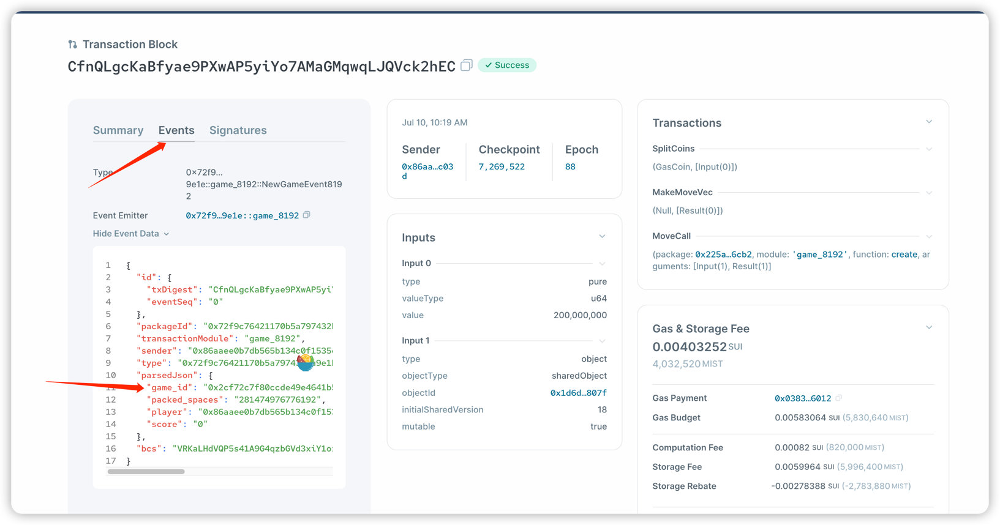

### SUI BullShark 破解脚本
1. npm install
2. npm install ts-node
3. ts-node index.ts
4. 复制 .env.example 为 .env 修改配置参数

#### 1. Journey 
目前仅支持 chat 聊天模式，其他游戏玩法官方未说明

#### 2. miniminersgame
自动化签到，官方服务不稳定，暂时观察中。

#### 3. CoinFlip
服务维护中

#### 4. SUI8192
1. 如何找到 SUI8192_ObjectId?
    在官网上手动创建新的一轮游戏之后，点开浏览器，复制下来即可。